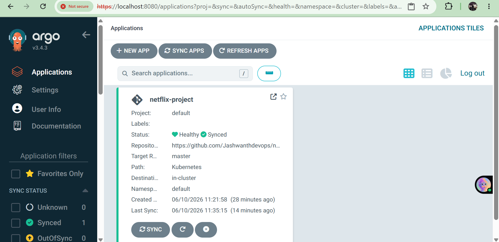
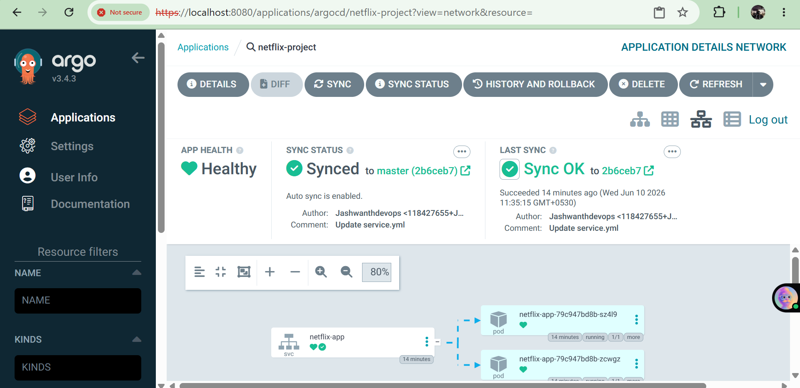
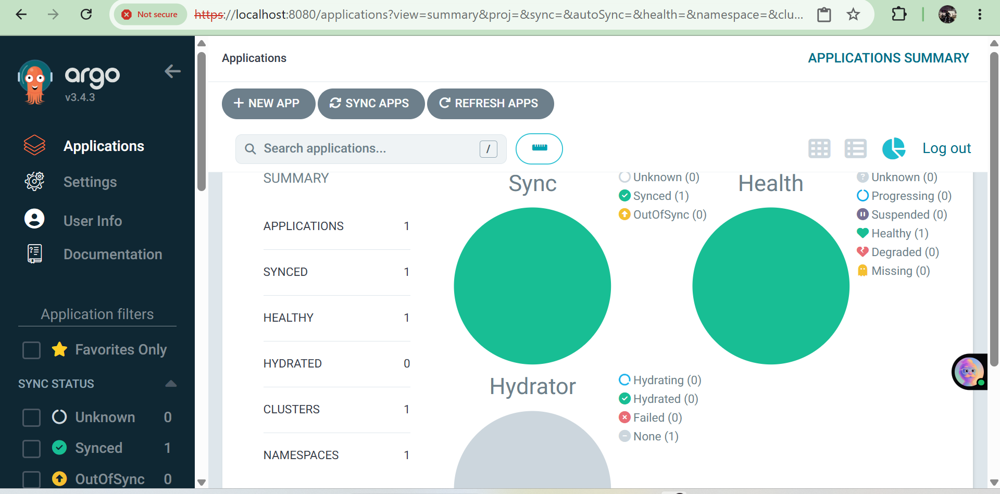
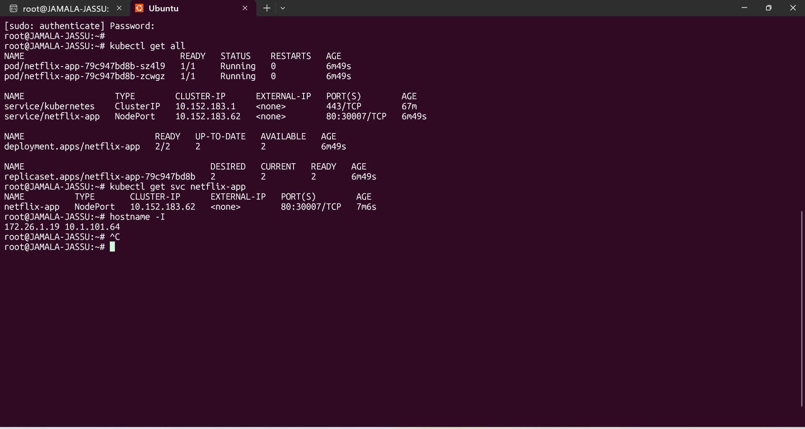
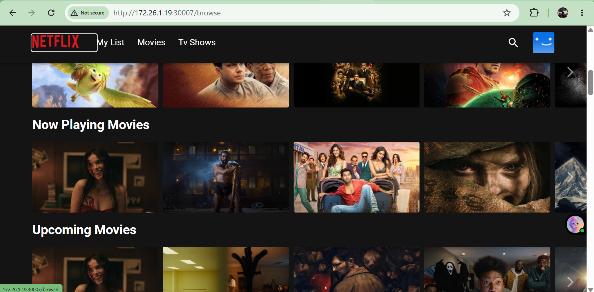

# Netflix Application Deployment using Argo CD and MicroK8s

## Project Overview

This project demonstrates a complete GitOps-based Continuous Deployment pipeline using Argo CD and MicroK8s Kubernetes.

The Netflix application source code is stored in GitHub and deployed automatically to a Kubernetes cluster through Argo CD. Any changes pushed to the repository are automatically synchronized with the cluster, ensuring the deployed application always matches the desired state stored in Git.

---

## Screenshots

### Argo CD Application Dashboard

Displays the Argo CD dashboard with the application status and synchronization details.



---

### Application Health & Sync Status

Shows the application in a **Healthy** and **Synced** state, confirming successful deployment through Argo CD.



---

### Resource Topology View

Visual representation of the Kubernetes resources managed by Argo CD, including Services, Deployments, ReplicaSets, and Pods.



---

### Kubernetes Resources

Verification of Kubernetes resources created during deployment.



---

### Netflix Application UI

The Netflix application successfully deployed and accessible through the Kubernetes NodePort service.



## Architecture

```text
Developer
    |
    v
GitHub Repository
    |
    v
Argo CD
    |
    v
MicroK8s Kubernetes Cluster
    |
    v
Deployment
    |
    v
Pods
    |
    v
NodePort Service
    |
    v
Netflix Application
```

---

## Technologies Used

* Kubernetes (MicroK8s)
* Argo CD
* Docker
* GitHub
* GitOps
* Ubuntu Linux
* YAML
* NodePort Service

---

## Project Objectives

* Deploy a Netflix application on Kubernetes.
* Implement GitOps using Argo CD.
* Enable automated synchronization from GitHub.
* Achieve self-healing deployments.
* Manage application lifecycle declaratively.

---

## Kubernetes Resources

### Deployment

* Application deployed using Kubernetes Deployment.
* Replica count: 2
* Self-healing enabled through Kubernetes and Argo CD.

### Service

* Service Type: NodePort
* Service Name: netflix-app
* NodePort: 30007

---

## Argo CD Configuration

### Repository

GitHub Repository configured as source repository.

### Sync Policy

* Automated Sync Enabled
* Self Heal Enabled
* Auto Create Namespace Enabled

### Destination

* Cluster: In-Cluster
* Namespace: default

---

## Deployment Steps

### Clone Repository

```bash
git clone <repository-url>
cd netflix-project
```

### Deploy Argo CD

```bash
kubectl create namespace argocd

kubectl apply -n argocd \
-f https://raw.githubusercontent.com/argoproj/argo-cd/stable/manifests/install.yaml
```

### Access Argo CD

```bash
kubectl port-forward svc/argocd-server -n argocd 8080:443
```

Open:

```text
https://localhost:8080
```

### Create Application

Configure:

* Repository URL
* Target Revision: master/main
* Path: Kubernetes
* Namespace: default

Enable Auto Sync.

---

## Validation

Verify deployment:

```bash
kubectl get all
```

Expected:

* Running Pods
* Active Deployment
* NodePort Service

Verify Service:

```bash
kubectl get svc netflix-app
```

Output:

```text
NAME          TYPE       PORT(S)
netflix-app   NodePort   80:30007/TCP
```

---

## GitOps Workflow

1. Developer pushes changes to GitHub.
2. Argo CD detects repository changes.
3. Argo CD synchronizes Kubernetes manifests.
4. Cluster state matches Git repository.
5. Application updates automatically.

---

## Project Results

* Successfully implemented GitOps deployment.
* Automated application synchronization.
* Kubernetes deployment managed through Argo CD.
* Self-healing and drift correction enabled.
* End-to-end Continuous Deployment achieved.

---

## Skills Demonstrated

* Kubernetes Administration
* Argo CD
* GitOps
* Docker
* Linux Administration
* YAML Configuration
* Continuous Deployment
* Infrastructure Automation
* Kubernetes Networking

---

## Future Enhancements

* Deploy using Helm Charts.
* Configure Ingress Controller.
* Implement CI/CD using GitHub Actions.
* Integrate Argo CD Image Updater.
* Deploy to Amazon EKS.
* Add Monitoring using Prometheus and Grafana.
